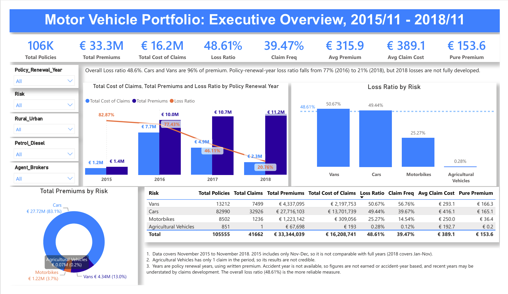

# Motor Vehicle Insurance Portfolio Analysis By Power BI
## 1. Project Overview

This project uses Microsoft Power BI to analyzes data of a motor vehicle insurance portfolio, with the objective of understanding portfolio's performance, claims experience and differences across major risk segments.

Dataset in the project is from an open source - Motor vehicle insurance data, published by Jorge Segura-Gisbert, Josep Lledó and Jose M. Pavía in European Actuarial Journal: 
  Segura-Gisbert, J., Lledó, J. & Pavía, J.M. Dataset of an actual motor vehicle insurance portfolio. Eur. Actuar. J. 15, 241–253 (2025). https://doi.org/10.1007/s13385-024-00398-0

The dataset contains 105,555 rows and 30 variables, from a Spanish non-life motor insurance company. It includes following key features,
    * Date related information: Date_start_contract, Date_last_renewal, Date_next_renewal for policy management and risk assessment
    * Economic variables: Premiums, Cost_claims_year for assessing product's profitability
    * Risk related variables: Value_vehicle, Power, Length, Weight, etc.

## 2. Project Objective

The objective of this project is to analyze policy and claims data and to transform summary into an interactive analytical dashboard in terms of,
  * Portfolio performance monitoring
  * Claims analysis
  * Insurance metrics for management team

## 3. Dataset

The dataset includes claims up to 2018, with policy's Date_last_renewal spanning from November 2015 to November 2018.

Part of variables are listed in the following table, which is provided by the authors and can be found via DOI link: https://doi.org/10.17632/5cxyb5fp4f.2.

Variables| Description
---------|---------------
ID| Internal identification number assigned to each annual contract formalized by an insured. Each policyholder can have multiple rows in the dataset, representing different annuities of the product.
Date_start _contract| Start date of the policyholder's contract (DD/MM/YYYY).
Date_last_renewal| Date of last contract renewal (DD/MM/YYYY).
Date_next_renewal| Date of the next contract renewal (DD/MM/YYYY).
Distribution_channel| Classifies the channel through which the policy was contracted. 0 for Agent and 1 for Insurance brokers.
Seniority| Total number of years that the insured has been associated with the insurance entity, indicating their level of seniority.
Premium| Net premium amount associated with the policy during the current year.
Cost_claims_year|	Total cost of claims for the insurance policy during the current year.
N_claims_year| Total number of claims incurred for the insurance policy during the current year.
Type_risk| Type of risk associated with the policy. Each value corresponds to a specific risk type: 1 for motorbikes, 2 for vans, 3 for passenger cars and 4 for agricultural vehicles
Area|	Dichotomous variable indicates the area. 0 for rural and 1 for urban (more than 30,000 inhabitants) in terms of traffic conditions.
Second_driver| 1 if there are multiple regular drivers declared, or 0 if only one driver is declared.
Year_matriculation|	Year of registration of the vehicle (YYYY).
Power| Vehicle power measured in horsepower.
Cylinder_capacity| Cylinder capacity of the vehicle.
Value_vehicle| Market value of the vehicle on 31/12/2019.
Type_fuel| Specific kind of energy source used to power a vehicle. Petrol (P) or Diesel (D).
Length|	Length, in meters, of the vehicle.
Weight|	Weight, in kilograms, of the vehicle.

The authors specifies that each row represents a policy during a period with each column corresponding to a specific variable. Each policyholder can have multiple rows with varying maturity dates, corresponding to annual observation window. The monetary variables, such as Premiums, are tax deducted.

## 4. Dashboard

### 4.1 Page 1: Executive Portfolio Overview

The executive dashboard offers a summary of the following,
  * Total Policies
  * Total Claims Cost
  * Written Premium
  * Loss Ratio
  * Claim Frequency
  * Claim Severity
  * Pure Premium
  * Portfolio performance by Policy Renewal Year
  * Loss Ratio by Risk
  * Claims Performance by Risk

Interactive filters placed on the left side allow users to analyze the motor vehicle portfolio by,
  * Risk Type - Motorbikes, Cars, Vans, Agricultural Vehicles
  * Area - Rural, Urban
  * Fuel Type - Petrol, Diesel, Non-applicable
  * Distribution Channel - Agents, Brokers
  * Policy Renewal Year - 2015, 2016, 2017, 2018 (Note that this year is derived from Date_last_renewal)

## 5. Metrics

  1. Loss Ratio: ratio of total claims cost relative to total premium.

$$
{\text{Loss Ratio}} = \frac{\text{Total Cost of Claims}} {\text{Total Premium}}
$$

  2. Claim Frequency: measure of claim incidence per exposure

$$
{\text{Frequency}} = \frac{\text{Total Number of Claims}} {\text{Total Exposure}}
$$

  3. Claim Severity: average cost per claim

$$
{\text{Severity}} = \frac{\text{Total Cost of Claims}} {\text{Total Number of Claims}}
$$

  4. Pure Premium: average loss per exposure or Frequency multiplied by Severity

$$
{\text{Pure Premium}} = \frac{\text{Total Cost of Claims}} {\text{Total Exposure}} = {\text{Frequency}} \times {\text{Severity}}
$$

## 6. Key Portfolio Findings

The Executive Dashboard shows the following,

  * The overall portfolio loss ration is 48.61%.
  * Cars account for the largest portion of written premium, representing circa 83% of the total.
  * Cars and Vans account for approximately 96% of the total written premium.
  * Vans have the highest claim frequency among the major four risk categories.
  * Agricultural Vehicles have very limited claims experience, and therefore its results are not as credible as other risks.
  * Motorbikes have lower Claim Frequency and Loss Ratio than Cars and Vans.
  * Cars and Vans have similar Pure Premium around €166 but differ in its drivers. Cars have higher severity than Vans (€416 VS €293), while have lower frequency than Vans (39.67% Vs 56.76%).
  * Policy_renewal_year loss ratio falls from 77.43% in 2016 to 20.76% in 2018 (Jan-Nov). Note that loss ratio for 2018 is understated, as policies renewed in 2018 have not yet reported losses when data was collected.
    
## 7. Tools & Skills

  * Power Query: Data Transformation, Feature Engineering
  
  * Power BI: Data Modelling, DAX, Interactive Filtering, Dashboard, KPI Development
    
  * Skills:
    * Actuarial Analytics: Premium, Frequency, Severity, Pure Premium, Loss Ratio
    * Data Analytics: Explanatory Data Analysis, Data Engineering, Interpretation and Implementation of Metrics

## 8. Next Steps & Limitations

  * Page 2 - Risk & Claims Analysis: to investigate the main drivers of claims performance across different segments, eg distribution channel, fuel type, Urban/Rural
  * Page 3 - Lapse/Retention Analysis
  
   ## Limitations:
      1. policy_renewal_year with written premium rather than accident year and earned premium
      2. policies renewed in 2018 have incomplete claims records

## 9. Disclaimer

This is a personal portfolio project using an openly published and anonymized insurance dataset.

The analysis is intended for applying skills in dashboard and actuarial analytics. The findings presented in the dashboard should not be interpreted as representing the current performance, pricing or underwriting decisions of the underlying insurance company.

